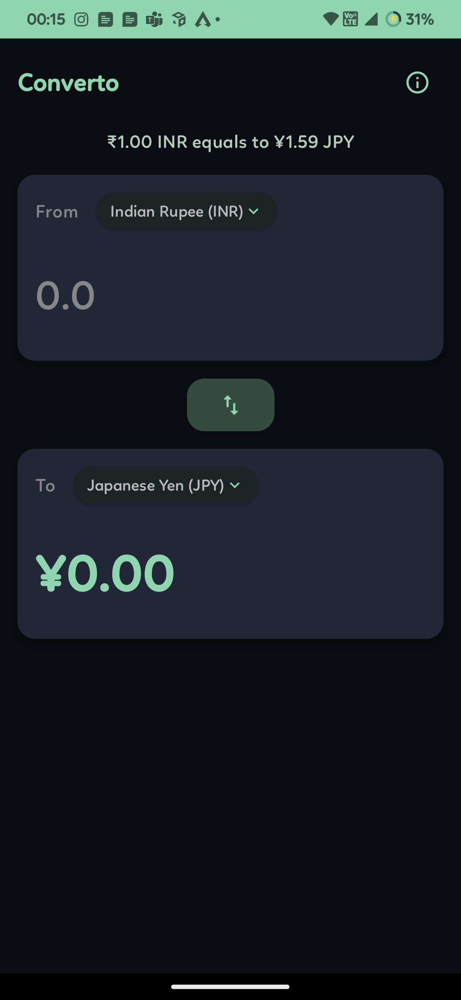
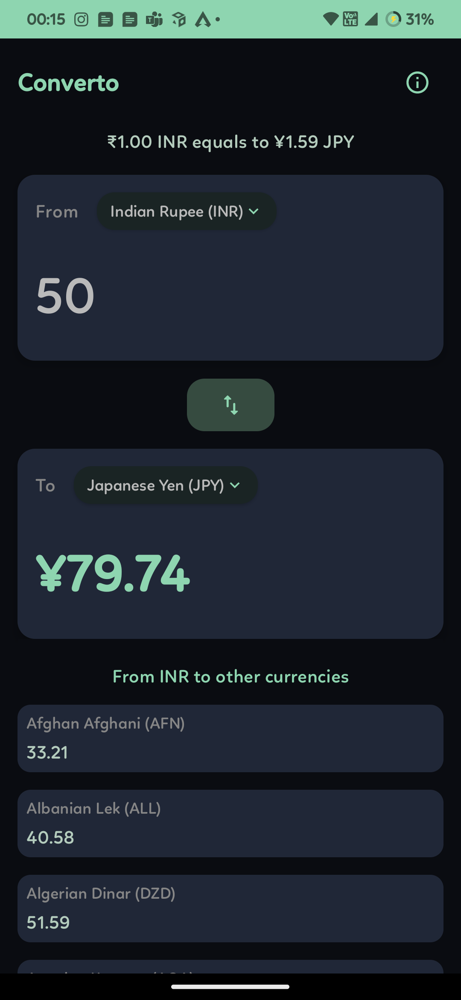

# 💹 Converto
A simple app for currency conversion which uses [Open Exchange Rates (free account)](https://openexchangerates.org/)

| Splash | Home | Converion |
|--------|------|-----------|
|  |  |  |

### 👷‍♂️ Architecture 
This project follows MVVM (clean architecture) which increases code testability and quality. As this is a small preject, I've skipped the UseCase layer which is beneficial for large projects with many screens and use-cases. Hilt library is used for dependency injection which helps achieving dependency inversion.

This app is created using latest UI framework (Jetpack Compose). Also added support for "Material You" theme engine (i.e. App adapts to device theme colors).

### 📝 Caching
App caches the latest currency rates and countries to save bandwidth which is refreshed after 30 minutes. Shared Prefs is used for caching as it is simple and takes less time for development but Datastore or Room is a preferred way (which is easy to migrate from as MVVM clean architecture used).

App also caches user's last session data which is selected currencies.

### 🧪 Unit tests 
Unit tests for Data layer, Utils and ViewModels are added to ensure functional correctness. I was unable to cover 100% code coverage given time constraints but I'm sure that I've covered almost all the important functions and all the different scenarios which can be referred to write other testcases.

### 🏛️ Directory structure 
Here is the directory structure of the app with unit tests code coverage

```bash
Converto
├── data                      // Data layer (Class 68%, Method 58%, Line 71%)
│   ├── datasources           // Class 63%, Method 60%, Line 70%
│   │   ├── local             // Class 68%, Method 63%, Line 64%
│   │   │   └── prefs
│   │   └── remote            // Class 57%, Method 54%, Line 75%
│   │       ├── interceptors
│   │       ├── mappers
│   │       └── services
│   ├── models
│   └── repos                 // Class 75%, Method 51%, Line 67%
│       ├── open_exchange
│       └── user             
├── di
├── ui
│   ├── components
│   │   └── core
│   ├── models
│   ├── screens
│   │   └── home              // HomeContentViewModel (Class 85%, Method 92%, Line 90%)
│   └── theme
└── utils                     // Class 92%, Method 94%, Line 91%
    └── extensions
```

### 🏗️ Build 
```bash
Android Studio: Android Studio Electric Eel | 2022.1.1
Kotlin: 1.8.10
Gradle: 7.5 (AGP 7.4.0)
Proguard: Not added yet only tested with debug build
```


### 🔖 License

```
MIT License

Copyright (c) 2023 Pavitra Raut

Permission is hereby granted, free of charge, to any person obtaining a copy
of this software and associated documentation files (the "Software"), to deal
in the Software without restriction, including without limitation the rights
to use, copy, modify, merge, publish, distribute, sublicense, and/or sell
copies of the Software, and to permit persons to whom the Software is
furnished to do so, subject to the following conditions:

The above copyright notice and this permission notice shall be included in all
copies or substantial portions of the Software.

THE SOFTWARE IS PROVIDED "AS IS", WITHOUT WARRANTY OF ANY KIND, EXPRESS OR
IMPLIED, INCLUDING BUT NOT LIMITED TO THE WARRANTIES OF MERCHANTABILITY,
FITNESS FOR A PARTICULAR PURPOSE AND NONINFRINGEMENT. IN NO EVENT SHALL THE
AUTHORS OR COPYRIGHT HOLDERS BE LIABLE FOR ANY CLAIM, DAMAGES OR OTHER
LIABILITY, WHETHER IN AN ACTION OF CONTRACT, TORT OR OTHERWISE, ARISING FROM,
OUT OF OR IN CONNECTION WITH THE SOFTWARE OR THE USE OR OTHER DEALINGS IN THE
SOFTWARE.
```
